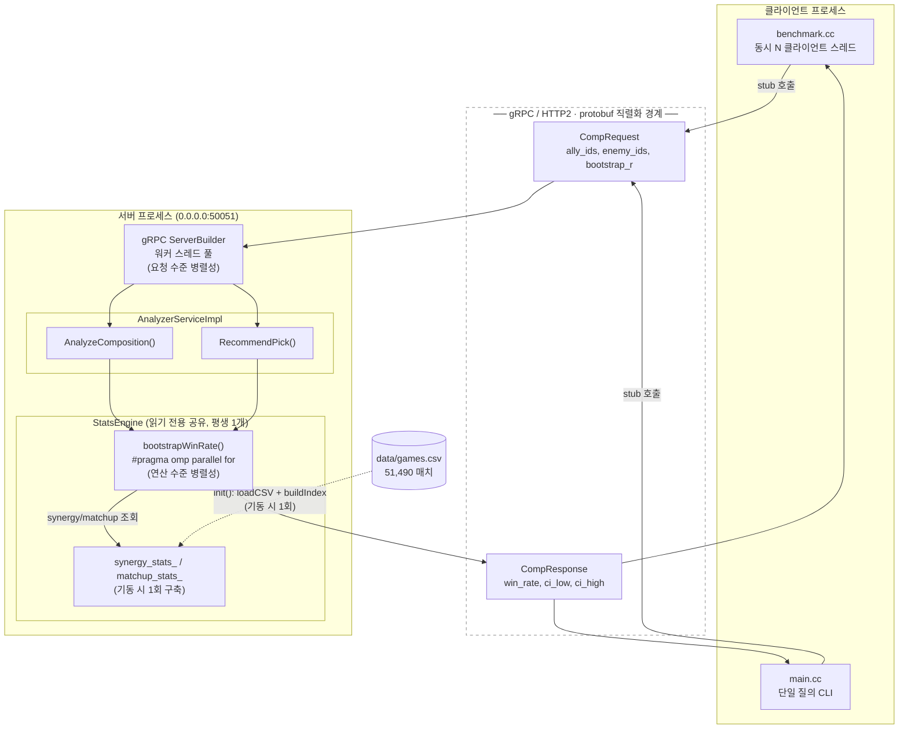
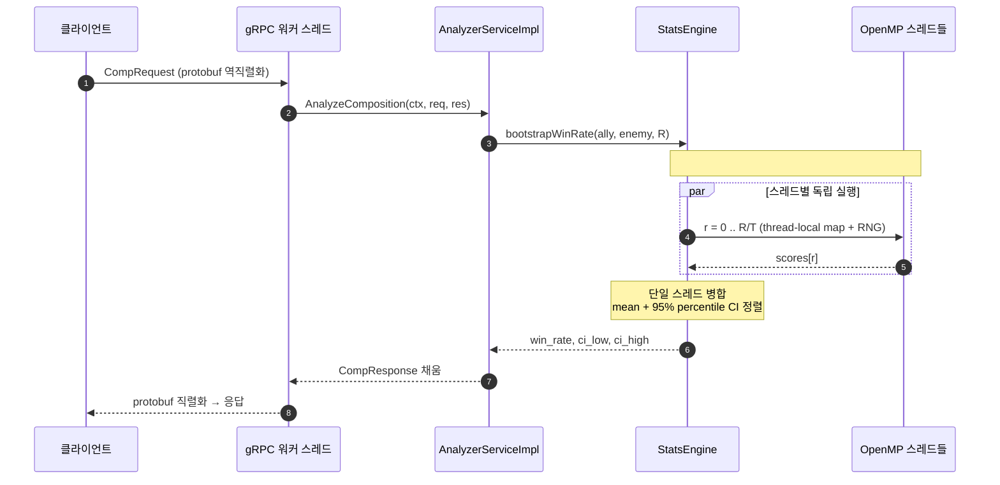
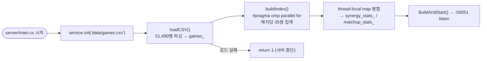

# 시스템 아키텍처

## 1. 전체 블록 다이어그램

클라이언트와 서버가 gRPC(네트워크 경계)로 분리되고, 서버 내부에서 **요청 수준 병렬성(gRPC 워커 스레드)** 과 **연산 수준 병렬성(OpenMP)** 두 층위가 겹친다.

**두 층위 병렬성**

| | 요청 수준 (gRPC 워커) | 연산 수준 (OpenMP) |
|---|---|---|
| 병렬 단위 | 클라이언트 요청 | 부트스트랩 리샘플 r |
| 담당 주체 | gRPC 워커 스레드 풀 | OpenMP 스레드 |
| 공유 데이터 | `StatsEngine` 인덱스 (읽기 전용 → 경합 적음) | `games_` 리샘플 (읽기 전용) |
| 동기화 | 없음 (무상태 요청) | thread-local map → 병합 / per-thread RNG |
| 측정 축 | 동시 클라이언트 수 → latency·throughput | OpenMP 스레드 수 → speedup |

---

## 2. 요청 처리 시퀀스 (1건의 AnalyzeComposition)

부트스트랩 단계에서 통신 → CPU로 병목이 이동하는 지점을 보여준다.

---

## 3. 기동 시 초기화 흐름 (1회성)

---